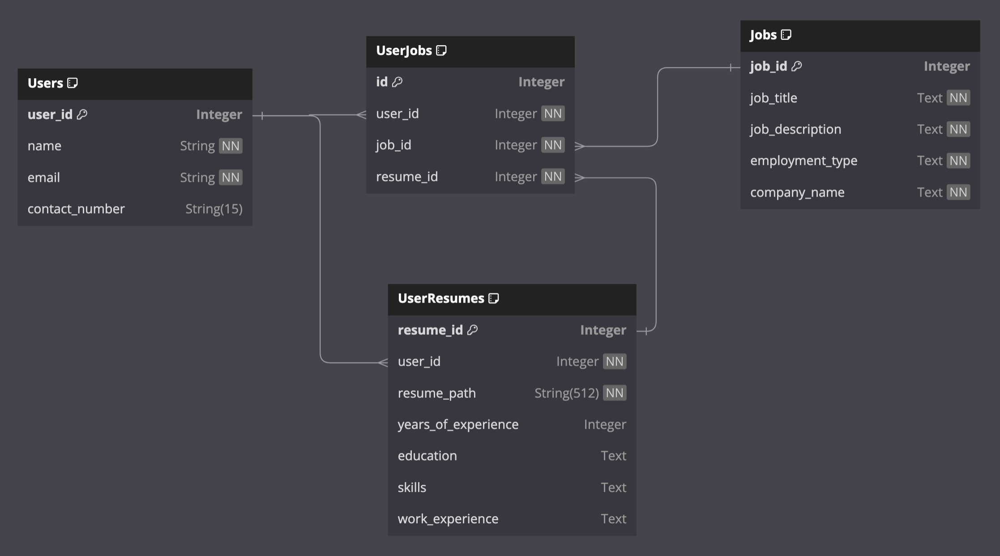
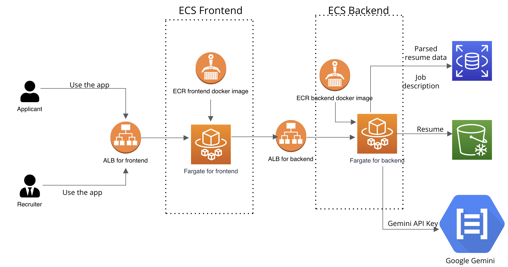
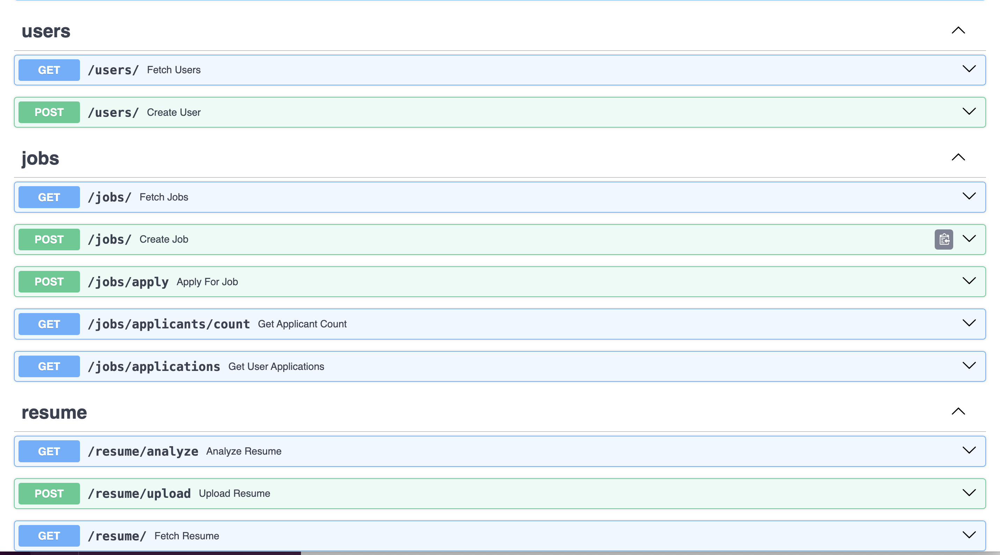
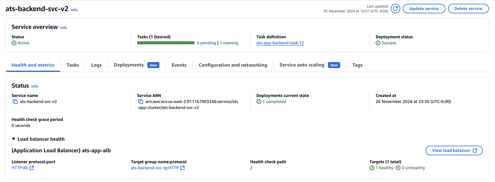
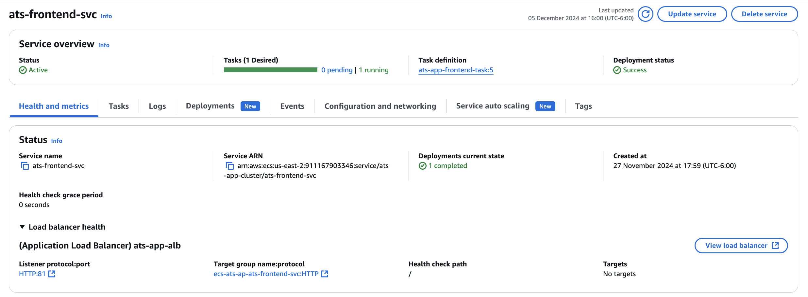
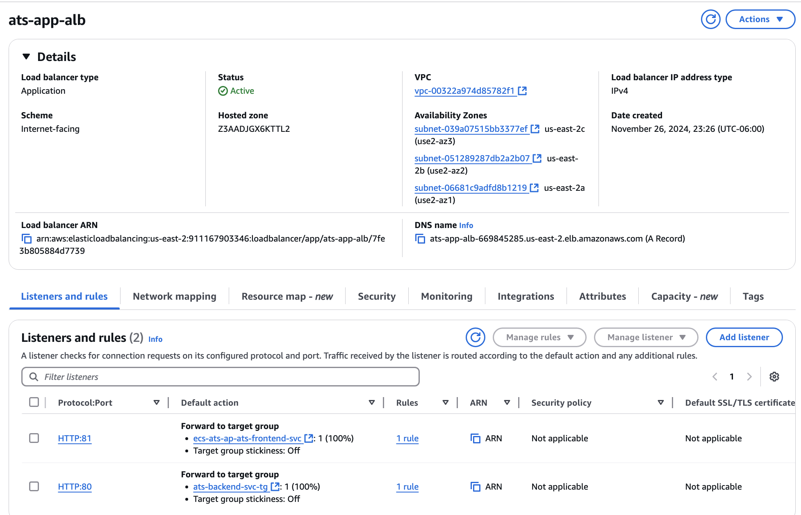

# ATSChecker

## Overview

**ATSChecker** is an **AI-powered Job Portal** designed to streamline the recruitment process for both recruiters and candidates.

### For Recruiters:
- **Smart Candidate Shortlisting**: Leverage AI-driven resume insights to identify the most suitable candidates efficiently.
- **Advanced Filtering**: Apply dynamic filters to shortlist candidates based on skills, experience, and other criteria.

### For Candidates:
- **Job Applications**: Easily apply for jobs and track application progress.
- **AI-Powered ATS Checker**: Match your resume against job descriptions to identify key strengths and areas for improvement.
- **Resume Insights**: Receive actionable suggestions to optimize your resume for Applicant Tracking Systems (ATS).

**ATSChecker** bridges the gap between recruiters and job seekers, offering personalized, data-driven insights to simplify hiring and job hunting.

## Implementation Details

### Database Design



### Cloud Architecture 


### API Specs




## Project Setup Guide

Follow the steps below to set up and run the **ATSChecker** project:

#### **1. Clone the Repository**
   ```bash
   git clone https://github.com/ayush9818/ATSChecker.git
   cd ATSChecker/
   ```

#### **2. Set Up the Backend**

   Refer to the [backend.md](docs/backend.md) file for detailed instructions on setting up the backend service.

#### **3. Set Up the Frontend**

   Refer to the [frontend.md](docs/frontend.md) file for detailed instructions on setting up the frontend service.

## Using the app

#### Steps for deployment

If you want to deploy the app on cloud from scratch:
- Clone the repository and navigate to the project directory
- Set up the backend:
  1. Follow the steps in [backend.md](docs/backend.md) to build and configure the backend locally
  2. Push your backend Docker image to your own container registry. Replace the AWS ECR repository link in the guide with your own repository link
  3. Deploy the backend container to your cloud environment server of choice
  4. Once the backend service is up and running, it should be accessible at your configured URL (e.g., http://your-backend-url)
- Set up the frontend:
  1. Follow the steps mentioned in [frontend.md](docs/frontend.md) to build and configure the frontend service locally
  2. Push your frontend Docker image to your own container registry. Replace the AWS ECR repository link in the guide with your own repository link
  3. Deploy the frontend container to your cloud environment server of choice
  4. Once the backend service is up and running, it should be accessible at your configured URL (e.g., http://your-frontend-url)

Ensure the BASE_API in both the .env files of frontend and backend points to the respective URL.

Here are some images from our deployment architecture:

Backend deployment:



Frontend deployment:



Fullstack App deployment:



## Key features of our app:

#### For job applicants:
For job applicants, we provide a complete job application and resume scoring system!

Salient features include:
- Uploading your information to the app is easy. Just open the applicants page in our app, and fill out your details: name, email id. If you are a new applicant, we will create a user, else we will fetch your old data
- After creating a user profile, you can upload your resume to our app. Resumes must be in pdf or word format.
- After uploading resumes, you can search for available job postings. Filters such as job role and employment type are available, after which you can see the uploaded jobs with their job descriptions.
- You can get an ATS analysis of your resume for each of these jobs before you decide to apply, which will give you an overall ATS score, as well as your strengths and areas of improvement.
- Applying to a job of your choice is simple, just click on apply on the job of your choice, and your most recent resume will be used to apply to the job.

#### For recruiter applicants:
For recruiter applicants, we provide a variety of other features other than just job posting

Salient features include:
- You can submit jobs with just the click of button. Just fill out the details for your job description, the name of your company and the employment type, and click Post Job. Done!
- You can filter through jobs using filters such as company name, job title and employment type, to easily find your postings.
- After filtering jobs, you can see job descriptions and get details such as the job id for the job. Using these job ids, you can see the applicant count for a particular job.
- You can filter through candidates for your job application, by using either skills seperated by commas, or minimum years of experience preferred.
-  Finally, you can select how many top candidates you want to see the details for. Skills used for filtering candidates above will carry over here. Just enter the number of candidates, and their details will be displayed.
