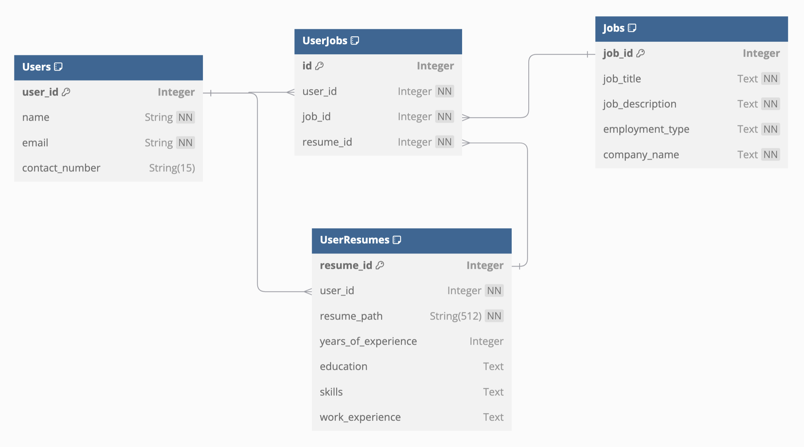

# ATSChecker

## Overview

**ATSChecker** is an **AI-powered Job Portal** designed to streamline the recruitment process for both recruiters and candidates.

### For Recruiters:
- **Smart Candidate Shortlisting**: Leverage AI-driven resume insights to identify the most suitable candidates efficiently.
- **Advanced Filtering**: Apply dynamic filters to shortlist candidates based on skills, experience, and other criteria.

### For Candidates:
- **Job Applications**: Easily apply for jobs and track application progress.
- **AI-Powered ATS Checker**: Match your resume against job descriptions to identify key strengths and areas for improvement.
- **Resume Insights**: Receive actionable suggestions to optimize your resume for Applicant Tracking Systems (ATS).

**ATSChecker** bridges the gap between recruiters and job seekers, offering personalized, data-driven insights to simplify hiring and job hunting.

## Implementation Details

### Database Design



### Cloud Architecture 


### API Specs


## Project Setup Guide

Follow the steps below to set up and run the **ATSChecker** project:

#### **1. Clone the Repository**
   ```bash
   git clone https://github.com/ayush9818/ATSChecker.git
   cd ATSChecker/
   ```

#### **2. Set Up the Backend**

   Refer to the [backend.md](docs/backend.md) file for detailed instructions on setting up the backend service.

#### **3. Set Up the Frontend**

   Refer to the [frontend.md](docs/frontend.md) file for detailed instructions on setting up the frontend service.


